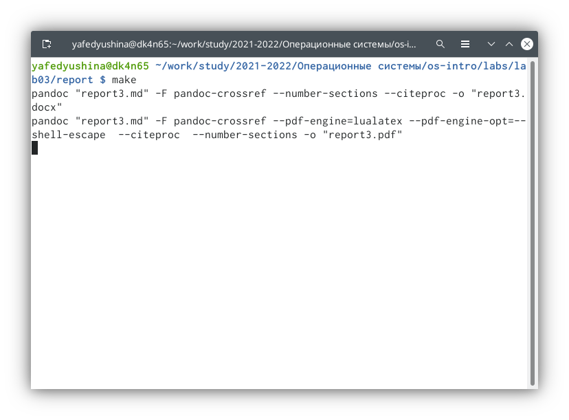

---
## Front matter
lang: ru-RU
title: "Отчёт по лабораторной работе №3"
author: "Федюшина Ярослава Андреевна"
institute: "Российский Университет Дружбы Народов"

## Formatting
toc: false
slide_level: 2
theme: metropolis
header-includes: 
 - \metroset{progressbar=frametitle,sectionpage=progressbar,numbering=fraction}
 - '\makeatletter'
 - '\beamer@ignorenonframefalse'
 - '\makeatother'
aspectratio: 43
section-titles: true
---

# Цель работы
Научиться оформлять отчёты с помощью легковесного языка разметки Markdown

# Работа с Markdown
Так как лабораторная №3 основана на лабораторной №2, мы берём основные элементы оттуда.
!{[прошлый отчёт](image3/first.png)

# Оформление хода работы
Расписываем алгоритм выполнения по шаблону прошлой лабораторной. Указываем ссылку на фото при формлении.

# Выполнение лабораторной работы
Выполняем лабораторную работу на основе шаблона прошлой

# Преобразование файлов
Преобразуем формат md в docx и pdf с помощью консоли

# Вывод

В ходе выполнения Лабораторной работы №3 я научилсь оформлять файлы из markdown
## {.standout}

Wer's nicht glaubt, bezahlt einen Taler
