---
## Front matter
lang: ru-RU
title: "Отчёт по лабораторной работе №4"
author: "Федюшина Ярослава Андреевна"
institute: |
	"Российский Университет Дружбы Народов"

## Formatting
toc: false
slide_level: 2
theme: metropolis
header-includes: 
 - \metroset{progressbar=frametitle,sectionpage=progressbar,numbering=fraction}
 - '\makeatletter'
 - '\beamer@ignorenonframefalse'
 - '\makeatother'
aspectratio: 43
section-titles: true
---

# Цель работы

Приобретение практических навыков взаимодействия пользователя с системой посредством командной строки.

# Ход работы

Определение полного имени домашнего каталога
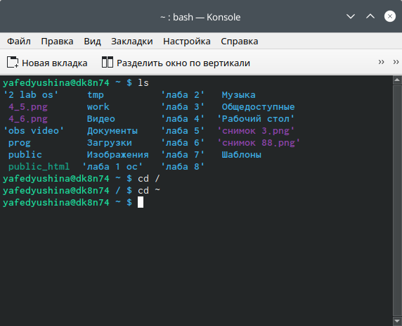

Переходим в каталог /tmp и и выводим его содержимое двумя способами
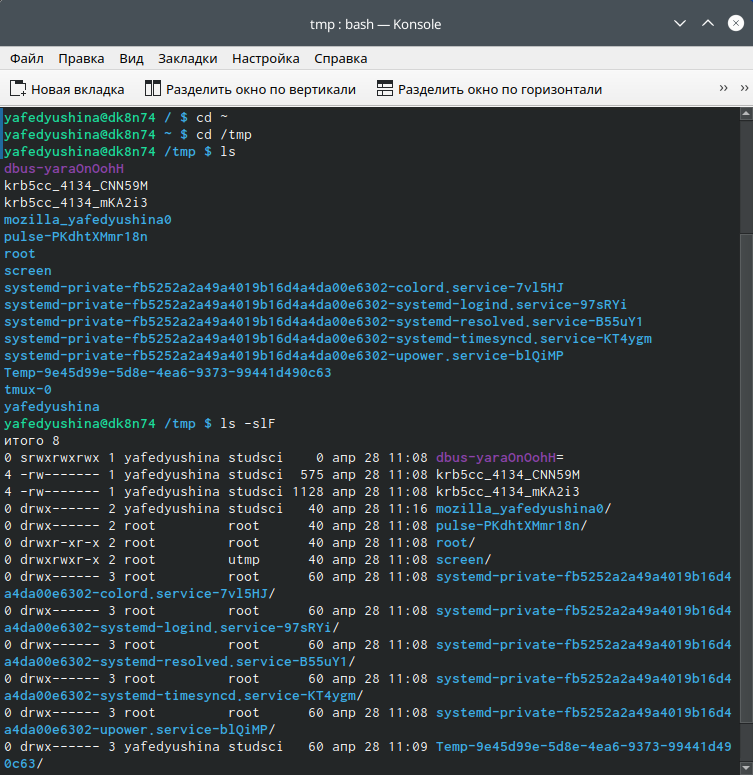

Опредеяем есть ли в каталоге /var/spool подкаталог cron
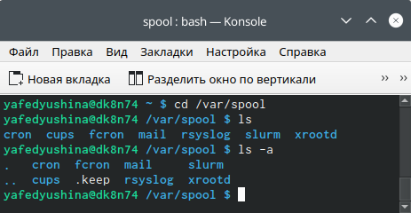

Перехожу  в домашний каталог и вывожу содержимое и определяю кто владелец каталогов (я)
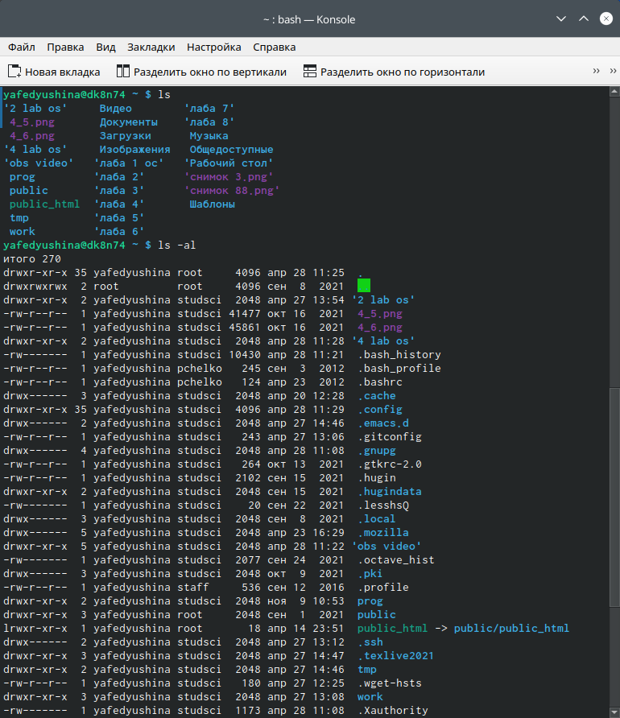

В домашнем каталоге создаю новый каталог newdir, а в нём новый каталог morefun. Далее создаю одной командой три новых каталога letters,memos,misk. Затем удаляю так же одной командой
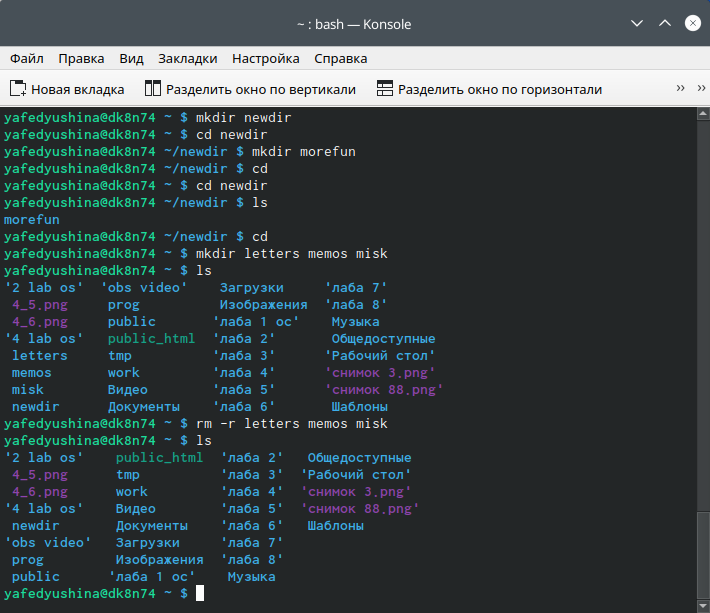

Пробую удалить каталог newdir и проверяю, удалён ли он
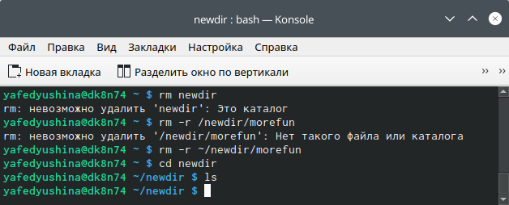

Командой man определяю опции команды ls
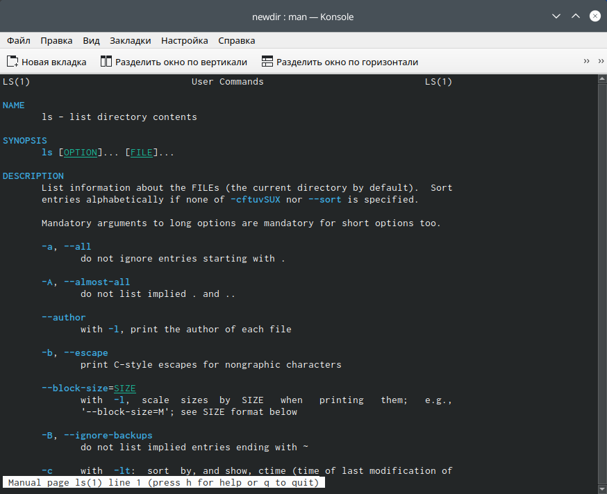

Так же поступаю и с командами cd,pwd,mkdir,rmdir,rm
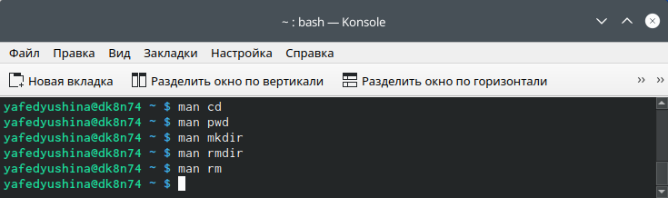

Выполеняю модификацию history
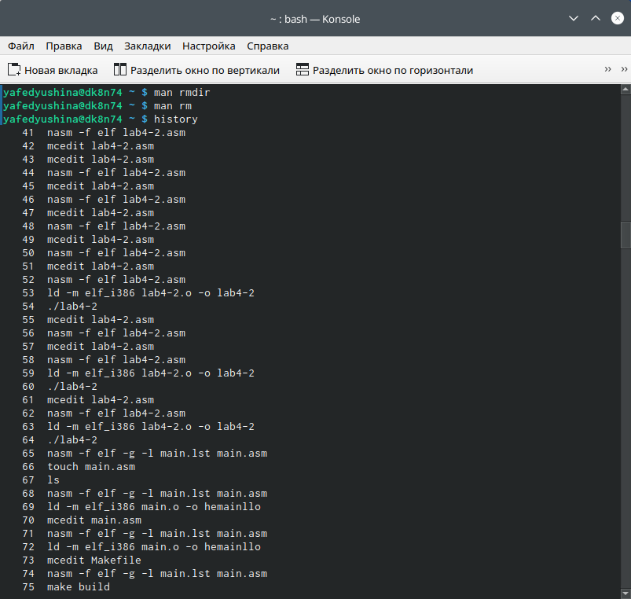
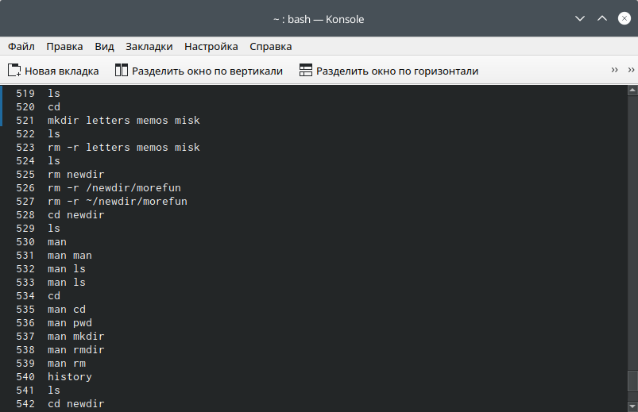
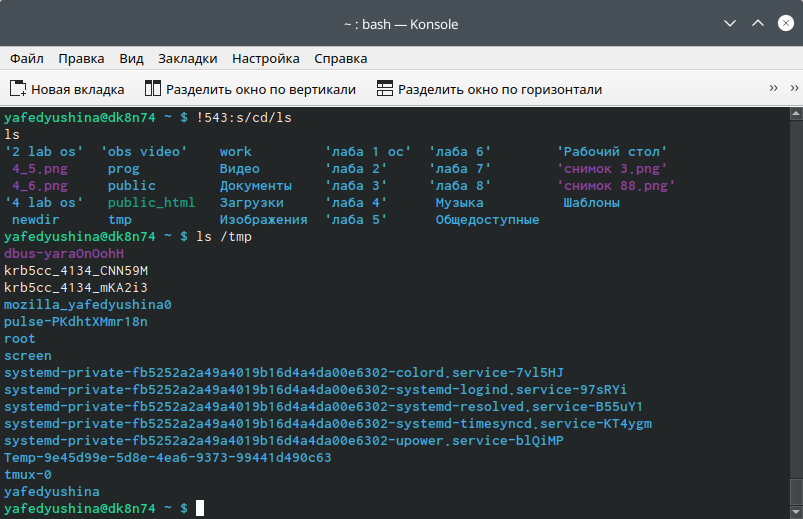

# Вывод

В ходе выполнения лабораторной работы №4 я приобрела практические навыки взаимодействия пользователя с системой посредством командной строки.

## {.standout}

Wer's nicht glaubt, bezahlt einen Taler
